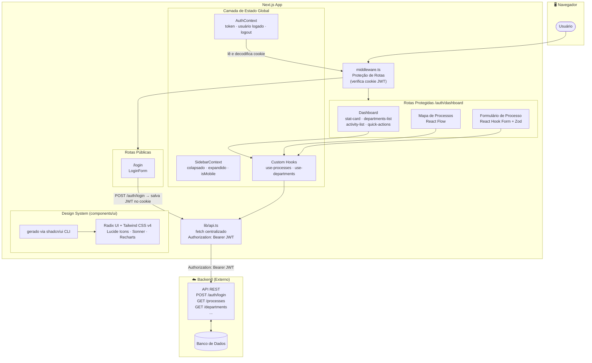

# Mapeamento de Processos — Aplicação Web

> Plataforma interna para cadastro, visualização e gestão de processos organizacionais por departamento. - Case Stage Consulting

---

## O que é esse projeto?

Essa aplicação foi construída para resolver um problema muito comum em empresas: **ninguém sabe exatamente quais processos existem, quem é responsável por cada um, se são manuais ou sistêmicos, e se estão documentados**.

A ideia é simples: você entra na plataforma, vê um painel com estatísticas, consegue navegar pelos departamentos, cadastrar processos, visualizá-los em um fluxograma interativo e editá-los quando precisar.

---

## Tecnologias utilizadas

Este projeto usa o que há de mais moderno no ecossistema React/Next.js:

| Tecnologia                     | Para que serve                                                                                                                                                      |
| ------------------------------ | ------------------------------------------------------------------------------------------------------------------------------------------------------------------- |
| **Next.js 16** (App Router)    | Framework principal. Controla as rotas, os layouts e o servidor.                                                                                                    |
| **React 19**                   | Biblioteca de interface. Tudo que você vê na tela é um componente React.                                                                                            |
| **TypeScript**                 | JavaScript com tipagem. Ajuda a evitar bugs e torna o código mais previsível.                                                                                       |
| **Tailwind CSS v4**            | Framework de CSS utilitário. Em vez de escrever CSS separado, você aplica classes diretamente no HTML.                                                              |
| **shadcn/ui**                  | CLI que gerou os componentes base da pasta `components/ui/`.                                                                                                        |
| **Radix UI**                   | Biblioteca por baixo do shadcn/ui. Fornece a lógica e acessibilidade dos componentes (Dialog, Select, Checkbox, Tooltip, etc). É ela que aparece no `package.json`. |
| **React Hook Form + Zod**      | Gerenciamento e validação de formulários. O Zod define as regras, o React Hook Form aplica.                                                                         |
| **@xyflow/react (React Flow)** | Biblioteca para criar diagramas interativos com nós e arestas — usada no mapa de processos.                                                                         |
| **Lucide React**               | Ícones em SVG, usados em toda a interface.                                                                                                                          |
| **next-themes**                | Alternância entre tema claro e escuro.                                                                                                                              |

---

## Estrutura de pastas

Entender onde está cada coisa é fundamental:

```
mapeamento-processos-app/
│
├── app/                          # Coração do projeto (Next.js App Router)
│   ├── globals.css               # Estilos globais e variáveis de tema (cores, fontes, etc.)
│   ├── layout.tsx                # Layout raiz: define fonte, tema, AuthProvider
│   ├── page.tsx                  # Redireciona "/" para "/login"
│   │
│   ├── login/
│   │   └── page.tsx              # Página de login pública
│   │
│   ├── contexts/
│   │   └── auth-context.tsx      # Contexto global de autenticação (quem está logado)
│   │
│   └── (routes)/
│       └── auth/
│           ├── layout.tsx        # Layout raiz da área autenticada
│           └── dashboard/        # Área protegida — só acessa quem tem token
│               ├── page.tsx      # Página principal do dashboard
│               ├── layout.tsx    # Layout com a Sidebar
│               ├── navigation-data.ts  # Itens do menu lateral
│               │
│               ├── components/   # Componentes exclusivos do dashboard
│               │   ├── dashboard-content.tsx   # Orquestrador principal do dashboard
│               │   ├── dashboard-header.tsx    # Cabeçalho com título dinâmico
│               │   ├── header-context.tsx      # Contexto do cabeçalho dinâmico
│               │   ├── stat-card.tsx           # Card de estatística (ex: "Total de processos")
│               │   ├── departments-list.tsx    # Lista/grade de departamentos
│               │   ├── department-modal.tsx    # Modal para criar/editar departamento
│               │   ├── activity-list.tsx       # Lista de atividades recentes
│               │   └── quick-actions.tsx       # Botões de ação rápida
│               │
│               ├── data/
│               │   └── dashboard-data.ts       # Dados estáticos (atividade recente, ações rápidas)
│               │
│               ├── departments/
│               │   ├── layout.tsx              # Layout da área de departamentos
│               │   ├── page.tsx                # Listagem de departamentos
│               │   ├── new/                    # (pasta reservada — sem page.tsx ainda)
│               │   └── components/
│               │       └── form.tsx            # Formulário completo de criação/edição de processo
│               │
│               └── processes/
│                   ├── page.tsx                # Mapa visual de processos (React Flow)
│                   ├── new/
│                   │   └── page.tsx            # Página de novo processo
│                   ├── [id]/
│                   │   └── edit/
│                   │       └── page.tsx        # Edição de processo específico
│                   └── components/             # Componentes exclusivos do mapa de processos
│                       ├── flow-contexts.ts    # Contextos do React Flow
│                       ├── flow-controls.tsx   # Controles personalizados do fluxograma
│                       ├── flow-layout.ts      # Lógica de layout automático dos nós
│                       ├── flow-nodes.tsx      # Nós customizados do fluxograma
│                       └── process-detail-modal.tsx  # Painel lateral de detalhes do processo
│
├── components/                   # Componentes reutilizáveis em todo o projeto
│   ├── login-form.tsx            # Formulário de login
│   ├── theme-switch.tsx          # Botão de alternar tema claro/escuro
│   │
│   ├── sidebar/                  # Sistema completo da barra lateral
│   │   ├── sidebar.tsx           # Componente principal da sidebar
│   │   ├── sidebar-context.tsx   # Estado global da sidebar (colapsado/expandido)
│   │   ├── sidebar-nav-item.tsx  # Item individual do menu
│   │   ├── sidebar-section.tsx   # Agrupamento de itens (seção)
│   │   └── index.ts              # Exportações centralizadas
│   │
│   └── ui/                       # Design system — componentes base
│       ├── button.tsx, card.tsx, checkbox.tsx, dialog.tsx
│       ├── field.tsx, input.tsx, input-group.tsx, label.tsx
│       ├── radio-group.tsx, select.tsx, separator.tsx
│       ├── spinner.tsx, textarea.tsx, tooltip.tsx
│
├── hooks/                        # Lógica de dados separada dos componentes
│   ├── use-processes.ts          # CRUD completo de processos
│   ├── use-departments.ts        # CRUD completo de departamentos
│   └── use-mobile.tsx            # Detecta se o usuário está em dispositivo móvel
│
├── lib/
│   ├── api.ts                    # Cliente HTTP centralizado (fetch com autenticação)
│   └── utils.ts                  # Funções utilitárias (ex: juntar classes CSS)
│
├── middleware.ts                 # Proteção de rotas no servidor
├── next.config.ts                # Configuração do Next.js
├── tailwind.config.ts            # Configuração do Tailwind CSS
└── components.json               # Configuração do shadcn/ui
```

---

## Como a autenticação funciona

A autenticação segue um fluxo bem direto:

1. O usuário acessa a aplicação → se não estiver logado, é redirecionado para `/login`.
2. Na tela de login, ele digita e-mail e senha → a aplicação faz uma requisição `POST /auth/login` para a API.
3. A API retorna um **JWT (JSON Web Token)** — um token criptografado com informações do usuário (id, e-mail, role, nome).
4. Esse token é salvo em um **cookie** chamado `access_token` com validade de 7 dias.
5. Em todas as requisições seguintes para a API, o token é enviado no header `Authorization: Bearer <token>`.
6. O **middleware** do Next.js lê esse cookie em cada navegação: se não existir, redireciona para login. Se existir, deixa passar.
7. O `AuthContext` lê e decodifica o token do cookie para exibir dados do usuário logado (nome, e-mail, etc.).

> **O que é um JWT?** É uma string codificada em base64 dividida em 3 partes separadas por ponto. A parte do meio contém os dados (payload), como `{ sub: "uuid", email: "...", role: "admin" }`. Não é necessário ir ao banco de dados em cada requisição para saber quem é o usuário — basta ler o token.

---

## O que o usuário consegue fazer

### Dashboard (página inicial após login)

A primeira tela que o usuário vê após logar. Ela mostra:

- **4 cards de estatísticas**: Total de processos, Processos com documentação, Processos sistêmicos, Processos manuais. Esses números vêm da API em tempo real.
- **Lista de departamentos**: Cada departamento mostra quantos processos tem, quantos são sistêmicos e quantos são manuais. Há botões para criar, editar e excluir departamentos.
- **Atividades recentes**: Registro das últimas ações no sistema.
- **Ações rápidas**: Atalhos para as funcionalidades mais usadas.

### Mapa Visual de Processos (`/auth/dashboard/processes`)

Esta é a tela mais sofisticada do projeto. Ela exibe todos os processos cadastrados em um **fluxograma interativo**, organizados por departamento.

Cada departamento vira um grupo visual colorido. Os subprocessos aparecem conectados ao processo pai por arestas (setas). O usuário pode:

- Mover os nós clicando e arrastando
- Clicar em um nó para abrir o painel lateral com detalhes completos (tipo, criticidade, ferramentas, responsáveis, link de documentação, etc.)
- Filtrar por departamento usando o select no topo
- Criar um subprocesso diretamente pelo painel lateral (botão "Adicionar Processo Filho")
- Editar um processo clicando no botão de editar no painel lateral

### Formulário de Processo

Formulário completo com validação via Zod. Os campos são:

| Campo                    | Descrição                                                  |
| ------------------------ | ---------------------------------------------------------- |
| **Título**               | Nome do processo (2 a 32 caracteres)                       |
| **Departamento**         | Select com os departamentos cadastrados                    |
| **Tipo**                 | Sistemático (usa um sistema) ou Manual (feito à mão/papel) |
| **Criticidade**          | Baixa, Média ou Alta                                       |
| **Processo pai**         | (Opcional) Hierarquia — um processo pode ter subprocessos  |
| **Ferramentas/Sistemas** | Tags com os sistemas utilizados (ex: SAP, Excel)           |
| **Responsáveis**         | Tags com os nomes dos responsáveis                         |
| **Link de documentação** | URL para o documento (ex: Confluence, Google Docs)         |
| **Descrição**            | Texto descritivo (20 a 100 caracteres)                     |

Se algum campo estiver incorreto, a mensagem de erro aparece abaixo do campo assim que o usuário tenta salvar.

---

## Arquitetura da aplicação

O diagrama abaixo mostra como as camadas se comunicam — do usuário até a API:



### Legenda das camadas

| Camada                           | Responsabilidade                                                                                           |
| -------------------------------- | ---------------------------------------------------------------------------------------------------------- |
| **middleware.ts**                | Intercepta toda navegação, verifica o cookie JWT e redireciona se necessário — roda no servidor do Next.js |
| **AuthContext / SidebarContext** | Estado global compartilhado. Elimina a necessidade de passar props manualmente entre componentes           |
| **Custom Hooks**                 | Isolam lógica de busca de dados, loading e erros. Componentes apenas consomem o resultado                  |
| **lib/api.ts**                   | Único ponto de contato com a API. Injeta o token automaticamente em toda requisição                        |
| **Design System**                | Componentes gerados pelo shadcn/ui CLI, com acessibilidade via Radix UI e visual via Tailwind              |

---

## Como os dados chegam até a tela (fluxo de dados)

O projeto segue uma arquitetura em camadas bem definida:

```
API (backend externo)
        ↑↓
lib/api.ts              ← cliente HTTP com autenticação automática por cookie
        ↑↓
hooks/use-*.ts          ← busca dados, gerencia loading/error, expõe funções de CRUD
        ↑↓
Componentes React       ← recebem os dados prontos via hook e renderizam a UI
```

**Por que separar assim?**

- `lib/api.ts` sabe **apenas** como fazer requisições HTTP. Se a URL base mudar, muda em um único lugar.
- `hooks/use-processes.ts` sabe apenas sobre processos: buscar, criar, editar, deletar. Nenhum componente precisa conhecer a URL da API.
- Os **componentes** só se preocupam com a tela. Eles chamam o hook e recebem os dados prontos: `{ processes, loading, error, createProcess, updateProcess, deleteProcess }`.

Isso torna o código muito mais fácil de manter e de testar.

---

## A Sidebar (menu lateral)

A sidebar foi construída do zero com um sistema de contexto próprio (`SidebarContext`). Ela:

- **Colapsa para ícones** em telas menores (80px de largura), exibindo apenas ícones com tooltips para identificação
- **Expande para menu completo** em telas grandes (280px), exibindo rótulos, seções agrupadas e hierarquia
- Detecta automaticamente se está em mobile usando o hook `use-mobile`
- Tem suporte completo a tema claro e escuro com cores definidas via variáveis CSS no Tailwind
- O item ativo no menu é determinado comparando a rota atual com o `href` de cada item de navegação

---

## Tema claro e escuro

A troca de tema usa a biblioteca `next-themes`. As cores são definidas como variáveis CSS no arquivo `globals.css` e alternadas automaticamente conforme o tema ativo. Assim, os componentes usam tokens como `bg-background`, `text-foreground`, `border-border`, e as cores mudam sozinhas sem precisar de uma classe `dark:` em cada elemento.

---

## Como rodar o projeto localmente

### Pré-requisitos

- Node.js 18 ou superior
- A API (backend) rodando localmente — geralmente em `http://localhost:3000`

### Passos

```bash
# 1. Clone o repositório
git clone <url-do-repositorio>
cd mapeamento-processos-app

# 2. Instale as dependências
npm install

# 3. Crie um arquivo de variáveis de ambiente
echo "NEXT_PUBLIC_API_URL=http://localhost:3000" > .env.local

# 4. Inicie o servidor de desenvolvimento
npm run dev
```

A aplicação estará disponível em **http://localhost:3001** (porta 3001 para não conflitar com a API na porta 3000).

### Scripts disponíveis

| Comando         | O que faz                                          |
| --------------- | -------------------------------------------------- |
| `npm run dev`   | Inicia o servidor de desenvolvimento na porta 3001 |
| `npm run build` | Gera a versão de produção otimizada                |
| `npm run start` | Inicia o servidor de produção (requer build antes) |
| `npm run lint`  | Verifica erros de código com ESLint                |

---

## Variáveis de ambiente

| Variável              | Descrição               | Exemplo                 |
| --------------------- | ----------------------- | ----------------------- |
| `NEXT_PUBLIC_API_URL` | URL base da API backend | `http://localhost:3000` |

> O prefixo `NEXT_PUBLIC_` é obrigatório para que a variável seja acessível no lado do cliente (navegador). Variáveis sem esse prefixo só existem no servidor.

---

## Decisões de arquitetura que vale entender

### App Router do Next.js

O projeto usa o **App Router** (introduzido no Next.js 13), não o Pages Router antigo. Isso significa:

- Cada pasta com `page.tsx` dentro de `app/` vira uma rota automaticamente
- Cada pasta com `layout.tsx` envolve todas as rotas filhas com aquele layout
- Pastas entre parênteses como `(routes)` são **grupos de rotas** — organizam o código mas não aparecem na URL final
- Pastas com `[id]` são **rotas dinâmicas** — o valor entre colchetes vira um parâmetro acessível via `params.id`

### Server Components vs Client Components

- Componentes com `"use client"` no topo rodam no **navegador** (têm acesso a `useState`, `useEffect`, eventos de clique, etc.)
- Componentes sem essa diretiva são **Server Components**: renderizados no servidor, mais rápidos, mas sem acesso a estado ou APIs do browser
- A maioria dos componentes interativos aqui são Client Components, pois precisam de estado e interações do usuário

### Proteção de rotas com Middleware

O arquivo `middleware.ts` roda em todo request **antes** de chegar na página. Ele lê o cookie do token e redireciona conforme necessário — isso é mais seguro do que proteger rotas só no lado do cliente, pois o usuário não consegue burlar manipulando o JavaScript no browser.

---

## Estrutura de um processo

Um processo cadastrado tem as seguintes propriedades:

```typescript
interface Process {
  id: string; // Identificador único (UUID)
  name: string; // Nome do processo
  type: "systemic" | "manual"; // Tipo do processo
  criticality: "low" | "medium" | "high"; // Criticidade
  active: boolean; // Se está ativo ou inativo
  documented: boolean; // Se tem documentação
  description: string | null; // Descrição textual
  departmentId: string; // A qual departamento pertence
  departmentName: string | null; // Nome do departamento
  parentId: string | null; // ID do processo pai (hierarquia)
  parentName: string | null; // Nome do processo pai
  tools: string[]; // Ferramentas/sistemas utilizados
  responsibles: string[]; // Responsáveis pelo processo
  documentLink: string | null; // Link para documentação externa
  childCount: number; // Quantos subprocessos tem
  createdAt: string; // Data de criação
  updatedAt: string; // Data da última atualização
}
```

---

_Projeto desenvolvido como case sugerido pela Stage consulting._  
_Stack: Next.js 16 · React 19 · TypeScript · Tailwind CSS v4 · React Flow_
